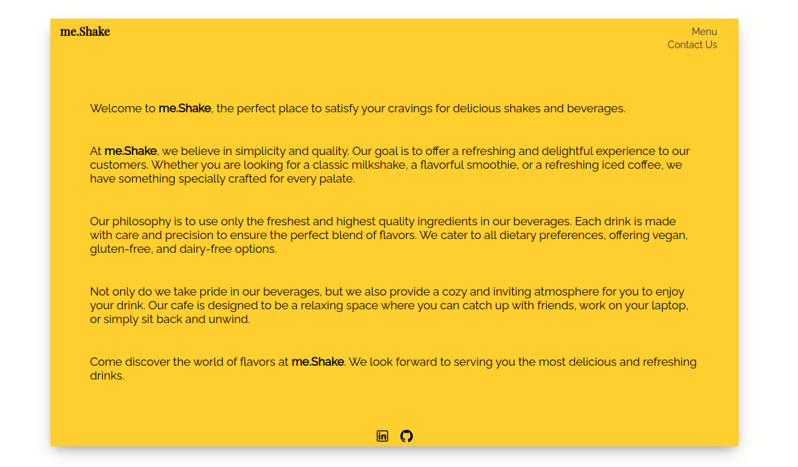

# Restaurant Page

This is a simple restaurant page project developed using HTML, CSS, and JavaScript. The project aims to showcase a responsive website for a restaurant, featuring different sections such as the home page, menu, contact information, and about section.



## Table of Contents

- [Demo](#demo)
- [Installation](#installation)
- [Usage](#usage)
- [Contributing](#contributing)
- [License](#license)

## Demo

You can access the live demo of the project at [Restaurant Page Demo](https://bentekku.github.io/restaurant-page/).


## Installation

To run this project locally, follow these steps:

Sure! Here's a sample README.md file for the `restaurant-page` project:

# Restaurant Page

This is a sample restaurant page project that focuses on building a responsive and interactive web page for a restaurant. It uses HTML, CSS, and JavaScript to create a dynamic experience for users.

## Project Features

*   Initial commit and folder structure.
*   Integration with Webpack for building and bundling assets.
*   Responsive design to ensure a seamless experience across different devices.
*   Interactive elements like menus, sliders, and reservation forms.
*   Integration with external APIs for menu data and location information.

## Usage

To view the restaurant page locally, follow these steps:

1.  Clone the repository:
  ```bash
      git clone https://github.com/bentekku/restaurant-page.git
  ```
4.  Navigate to the project directory:
  ```bash
      cd restaurant-page
  ```
7.  Install the dependencies:
  ```bash
      npm install
  ```
9.  Build the assets:
  ```bash
        npm run build
  ```
13.  Open the `index.html` file in your preferred web browser.

## Usage

Feel free to use this project as a template or reference for creating your own restaurant website. Modify the HTML, CSS, and JavaScript files according to your requirements. Customize the content, images, and styling to reflect your restaurant's branding and design.

You can edit the following files to make changes:

- `index.js`: Update the structure and content of website wrapper.
- `menu.js`: Customize the menu items and their descriptions.
- `contact.js`: Modify the contact form or add additional contact information.
- `homepage.js`: Update the structure and content of the home page.
- `src/style.css`: Adjust the styling and layout of the pages.

## Contributing

Contributions are welcome! If you have any suggestions, bug reports, or feature requests, please open an issue on the [GitHub repository](https://github.com/bentekku/restaurant-page/issues) or submit a pull request.

When contributing to this project, please ensure that your changes are well-documented and follow the established coding conventions.

## License

This project is licensed under the [MIT License](LICENSE). Feel free to use, modify, and distribute the code for personal or commercial purposes.
